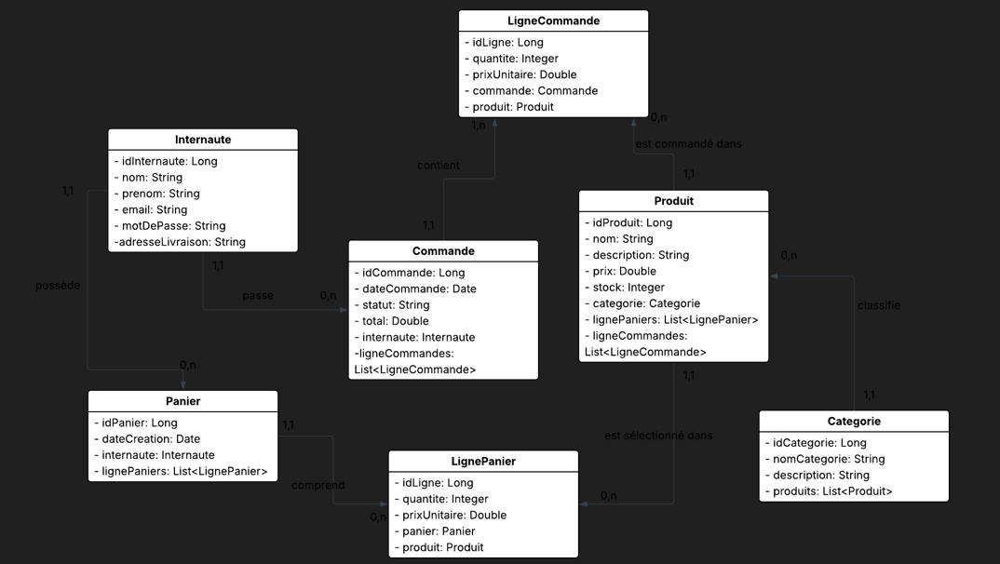
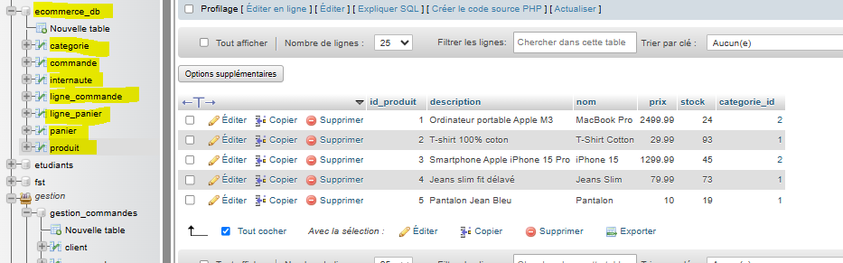
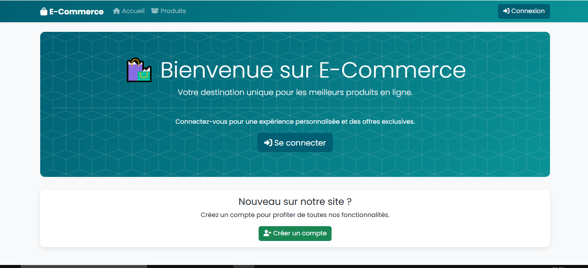
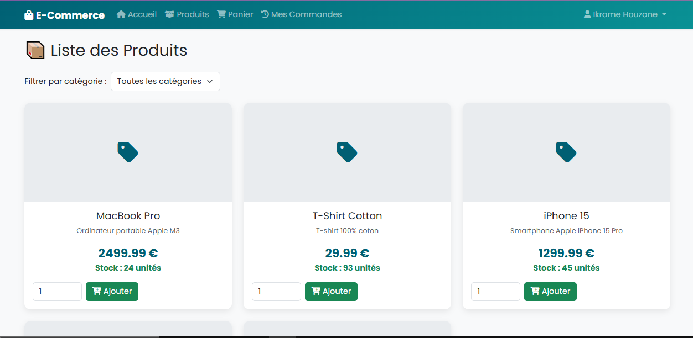
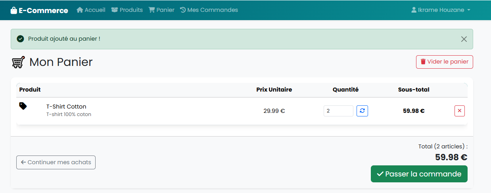
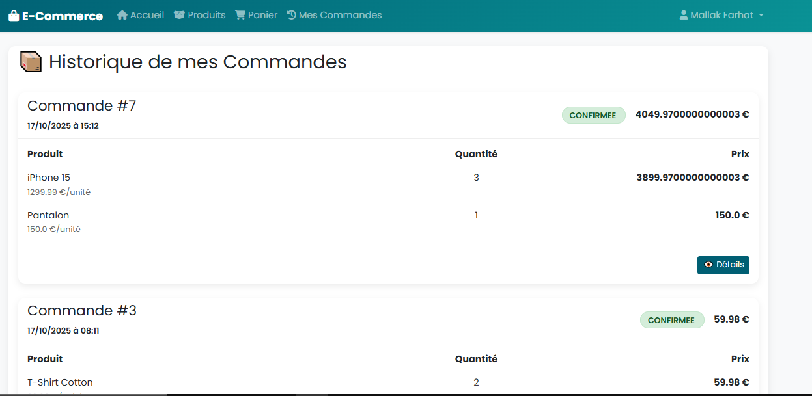

# Atelier 2: Application web basée sur MVC2 et JPA

Ce projet est une application web e-commerce simple développée en Java EE, utilisant les Servlets, JSP et JPA pour la persistance des données.

## Fonctionnalités

L'application offre les fonctionnalités principales suivantes :

*   **Gestion des Utilisateurs (Internautes)** :
    *   Inscription et Connexion (Authentification).
    *   Gestion des profils utilisateurs.
*   **Gestion des Catégories** :
    *   Ajout, modification, suppression et affichage des catégories de produits.
*   **Gestion des Produits** :
    *   Ajout, modification, suppression et affichage des produits.
    *   Visualisation détaillée d'un produit.
*   **Panier d'Achat** :
    *   Ajout et suppression de produits du panier.
    *   Affichage du contenu du panier.
*   **Gestion des Commandes** :
    *   Confirmation de commande à partir du panier.
    *   Historique des commandes pour chaque utilisateur.
    *   Visualisation des détails d'une commande.

## Diagramme de classes


## Rôle des Servlets

Chaque Servlet joue un rôle spécifique dans la gestion des requêtes et la logique métier de l'application :

*   **`AuthServlet`** : Gère les processus d'authentification des utilisateurs (connexion et déconnexion).
*   **`RegisterServlet`** : Prend en charge l'enregistrement de nouveaux utilisateurs dans le système.
*   **`CategorieServlet`** : Responsable des opérations CRUD (Créer, Lire, Mettre à jour, Supprimer) pour les catégories de produits.
*   **`ProduitServlet`** : Gère les opérations CRUD pour les produits, y compris l'affichage des listes de produits et les détails de chaque produit.
*   **`InternauteServlet`** : S'occupe de la gestion des informations des utilisateurs (internautes), y compris la création, la lecture, la mise à jour et la suppression de leurs profils.
*   **`PanierServlet`** : Gère la logique liée au panier d'achat, permettant d'ajouter, de supprimer et de visualiser les articles du panier.
*   **`CommandeServlet`** : Traite la création, la consultation et l'historique des commandes passées par les utilisateurs.

## Entités JPA

Les entités JPA (Java Persistence API) modélisent les objets métier de l'application et leur persistance en base de données :

*   **`Categorie`** : Représente une catégorie de produits (ex: Électronique, Vêtements), permettant d'organiser les produits.
*   **`Commande`** : Représente une commande passée par un `Internaute`, contenant une ou plusieurs `LigneCommande`.
*   **`Internaute`** : Représente un utilisateur enregistré de l'application, avec ses informations personnelles et ses commandes.
*   **`LigneCommande`** : Détaille un article spécifique au sein d'une `Commande`, incluant le `Produit` et la quantité commandée.
*   **`LignePanier`** : Représente un article temporaire dans le `Panier` d'un `Internaute`, avec le `Produit` et la quantité souhaitée.
*   **`Panier`** : Représente le panier d'achat actuel d'un `Internaute`, regroupant les `LignePanier` avant la validation d'une commande.
*   **`Produit`** : Représente un article disponible à la vente, avec ses détails (nom, description, prix, etc.) et sa `Categorie`.

## Diagramme de classes


## Technologies Utilisées

*   **Backend** :
    *   Java EE (Jakarta EE) : Servlets pour la logique métier et la gestion des requêtes.
    *   JSP (JavaServer Pages) : Pour la génération des vues dynamiques.
    *   JPA (Java Persistence API) avec EclipseLink : Pour la persistance des objets Java dans la base de données.
    *   Maven : Outil de gestion de projet et de construction.
*   **Base de Données** :
    *   MySQL : Base de données relationnelle.
*   **Frontend** :
    *   CSS : Pour la structure et le style des pages web.

## Structure du Projet

Le projet suit une architecture MVC (Modèle-Vue-Contrôleur) :

*   `src/main/java/ma/fstt/webjpa2/controller/` : Contient les Servlets qui agissent comme contrôleurs, gérant les requêtes HTTP et interagissant avec le modèle.
*   `src/main/java/ma/fstt/webjpa2/model/` : Contient les classes entités JPA (Produit, Categorie, Internaute, Commande, etc.) qui représentent le modèle de données de l'application.
*   `src/main/webapp/` : Contient les fichiers JSP (vues) et les ressources statiques (CSS).
    *   `src/main/webapp/auth/` : Pages d'authentification (login, register).
    *   `src/main/webapp/categories/` : Pages de gestion des catégories.
    *   `src/main/webapp/commandes/` : Pages de gestion et d'historique des commandes.
    *   `src/main/webapp/internautes/` : Pages de gestion des internautes.
    *   `src/main/webapp/panier/` : Page du panier d'achat.
    *   `src/main/webapp/produits/` : Pages de gestion et d'affichage des produits.
*   `src/main/resources/META-INF/persistence.xml` : Fichier de configuration JPA pour la connexion à la base de données.

## Configuration du Projet

### 1. Configuration de la Base de Données (MySQL)

Le projet utilise MySQL comme base de données. La configuration de la connexion est définie dans le fichier `src/main/resources/META-INF/persistence.xml`.

*   **Nom de la base de données** : `ecommerce_db` (doit être créée manuellement).
*   **URL de connexion** : `jdbc:mysql://localhost:3306/ecommerce_db`

**Extrait de `persistence.xml` :**
```xml
     <!-- Configuration MySQL EXPLICITE -->
     <property name="jakarta.persistence.jdbc.driver" value="com.mysql.cj.jdbc.Driver"/>
     <property name="jakarta.persistence.jdbc.url" value="jdbc:mysql://127.0.0.1:3306/ecommerce_db?useSSL=false&amp;serverTimezone=UTC"/>
     <property name="jakarta.persistence.jdbc.user" value="root"/>
     <property name="jakarta.persistence.jdbc.password" value=""/>
```



### 2. Fichier `pom.xml`

Le fichier `pom.xml` gère les dépendances du projet (Java EE, JPA/JSTL, MySQL Connector,...) et la configuration du build Maven.


## Captures d'écran

Voici quelques captures d'écran de l'application en fonctionnement. 

```markdown

```


### Page d'accueil



### Page de connexion


### Liste des produits



### Panier d'achat



### Historique des commandes

---

## Auteur

*  Ikrame Houzane